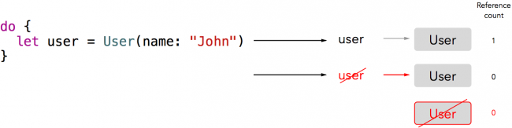
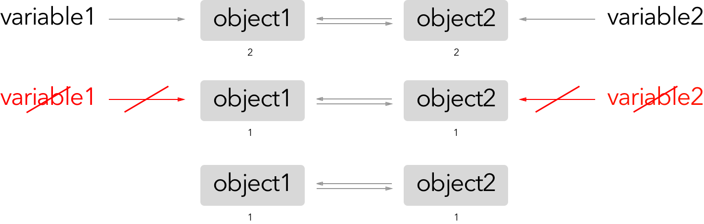
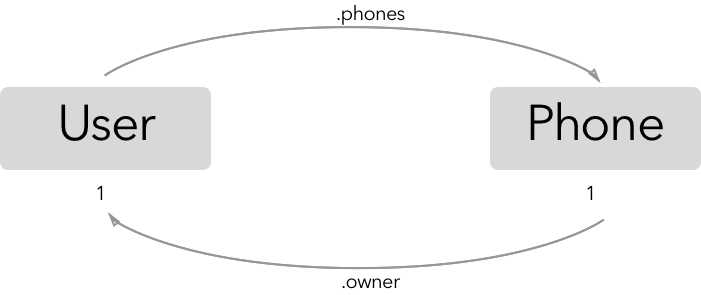
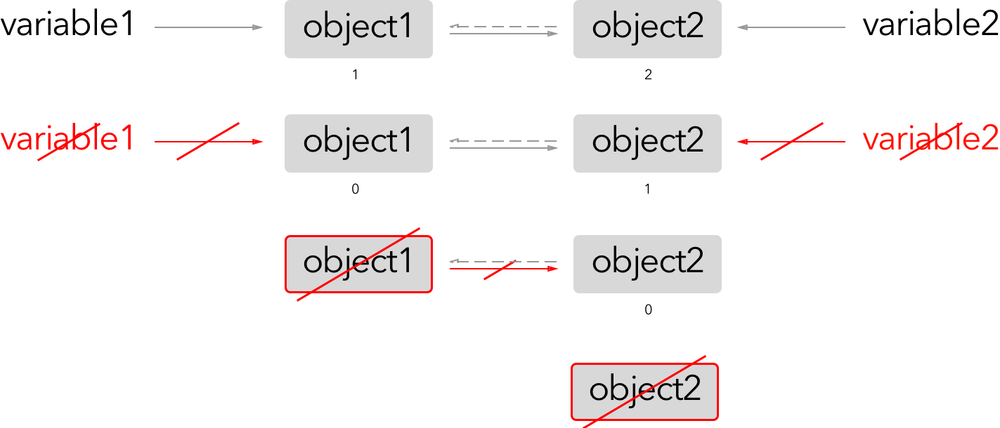
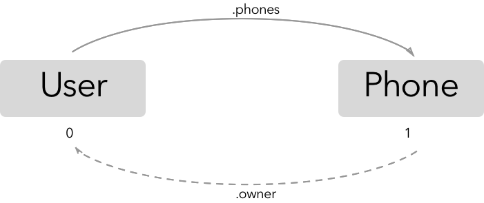
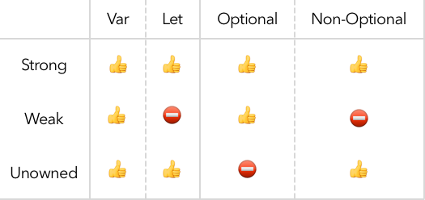
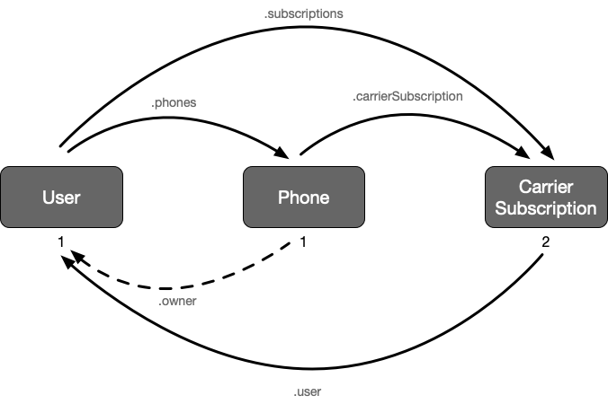
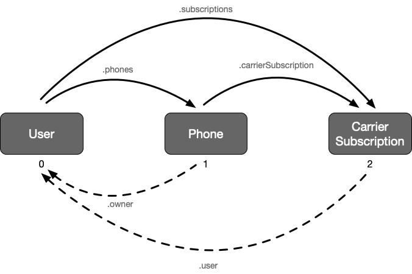
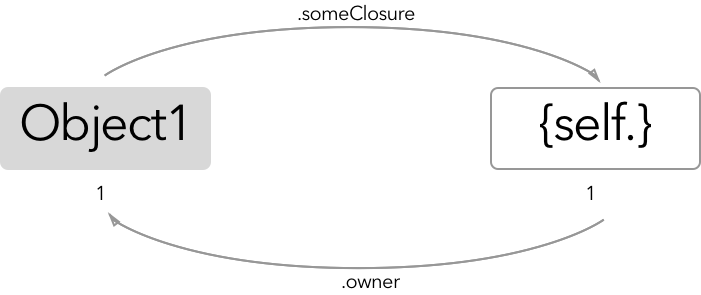
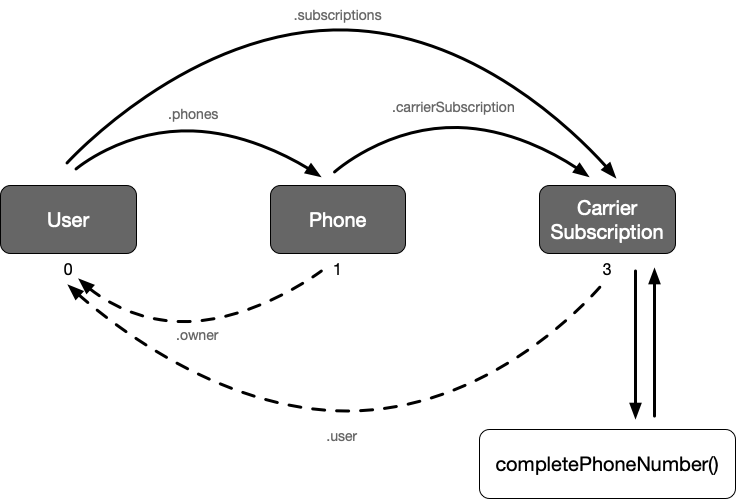

**`ARC`** 即 **`Automatic Reference Counts`** 自动引用计数，可以用于对象的自动回收。


示例：定义一个User类，在初始化和销毁时输出打印语句

```swift
class User {
    var name: String
    
    init(name: String) {
        self.name = name
        
        print("初始化 \(name)")
    }
    
    deinit {
        print("销毁 \(name)")
    }
}

// 使用
let user = User(name: "John")
// 打印结果
初始化 John
```

因为 **`user`** 始终在在作用域内，所以 **`deinit`** 不会被调用，可以将上面的语句包含在 **`do`** 语句中，这样do语句完成后，就跳出该作用域了

```swift
do {
    let user = User(name: "John")
}

// 打印结果
初始化 John
销毁 John
```

这个例子主要是想表达一个对象正常情况下是如何初始化，如何被销毁的


## 1.一个对象的生命周期

swift中对象的生命周期由5个阶段组成：

1. **`Allocation`**： 从栈或堆中分配内存
2. **`Initialization`**: **`init`** 初始化
3. **`Usage`**：使用
4. **`Deinitialization`**: **`deinit`** 销毁
5. **`Deallocation`**: 将内存返回给栈或堆，进行回收


**`Reference counts`** 也称为 引用计数，这个数量决定一个对象是否再需要，如果引用为0，则对象不再需要，会被销毁。

上面示例中的 **`user`** 对象，引用计数如下：




## 2.引用循环(Reference Cycles)

大多数情况下，ARC会帮我们自动处理对象的销毁工作。

但是假如2个对象相互引用，因为2个对象的引用计数始终不为0，因此不会被销毁。



上面图示是一种 **`强引用循环(strong reference cycle)`**。

可以看出 **`object1`** 和 **`object2`** 相互引用，变量销毁后，它们引用计数为 **`1`**， 因此2个对象不会被销毁。


## 3.检查你的引用(Checking Your References)

接着上面的例子，创建一个 **`Phone`** 类

```swift
class User {
    var name: String
    // 用户拥有的手机
    private(set) var phones: [Phone] = []
    
    init(name: String) {
        self.name = name
        
        print("初始化 \(name)")
    }
    
    func addPhone(phone: Phone) {
        phones.append(phone)
        // 手机的持有者
        phone.owner = self
    }
    
    deinit {
        print("销毁 \(name)")
    }
}

class Phone {
    let model: String
    // 手机的主人
    var owner: User?
    
    init(model: String) {
        self.model = model
        
        print("手机模型 \(model)")
    }
    
    deinit {
        print("销毁手机模型 \(model)")
    }
}

do {
  let user = User(name: "John")
  let iphone = Phone(model: "iphone6s")
  user.addPhone(phone: iphone)
}
```

在 **`Playground`**  中运行上面的代码，会打印

```swift
初始化 John
手机模型 iphone6s
```

会发现 **`user`** 和 **`iphone`** 并没有被回收，两者之间建立了强引用循环，导致对象不会被回收



## 4. 弱引用(Weak References)

为了打破强引用循环，可以将相互引用的对象之间的关系设置为 **`弱(weak)`**。

除非特别的指定，所有的引用都是强引用，会影响引用计数。**弱引用则不会增加对象的引用计数**，另外：

- **弱引用永远都要声明为可选类型，因此必须使用 `var` 声明**
- 当引用数变为0时，引用会自动的设置为 **`nil`**



上图中虚线表示弱引用，实线表示强引用。 **`object1`** 有1个强引用，一个弱引用（**`object2`** 对 **`object1`** 是弱引用）， **`object2`** 有2个强引用。


回到 **`Phone`** 类中，将 **`owner`** 属性声明为 **`weak`**

```swift
class User {
    var name: String
    private(set) var phones: [Phone] = []
    
    init(name: String) {
        self.name = name
        
        print("初始化 \(name)")
    }
    
    func addPhone(phone: Phone) {
        phones.append(phone)
        // 手机的持有者
        phone.owner = self
    }
    
    deinit {
        print("销毁 \(name)")
    }
}

class Phone {
    let model: String
    // 将phone对user的引用设置为弱引用
    weak var owner: User?
    
    init(model: String) {
        self.model = model
        
        print("手机模型 \(model)")
    }
    
    deinit {
        print("销毁手机模型 \(model)")
    }
}

do {
  let user = User(name: "John")
  let iphone = Phone(model: "iphone6s")
  user.addPhone(phone: iphone)
}
```

打印结果

```swift
初始化 John
手机模型 iphone6s
销毁 John
销毁手机模型 iphone6s
```




## 5. 无主引用(Unowned References)

这是另一种不增加引用计数的修饰符：**`unowned`**.

**`unowned`** 和 **`weak`** 有什么区别呢？弱引用必须为可选类型，当引用的对象不存在时，自动设置为 **`nil`**; 无主引用则不能为可选类型，如果你引用一个已经被销毁的对象属性，会抛出错误。



在上面的代码中添加一个 **`CarrierSubscription`** （运营商订阅者）类


```swift
class User {
    var name: String
    private(set) var phones: [Phone] = []
    // 使用的运营商
    var subscriptions: [CarrierSubscription] = []
    
    init(name: String) {
        self.name = name
        
        print("初始化 \(name)")
    }
    
    func addPhone(phone: Phone) {
        phones.append(phone)
        // 手机的持有者
        phone.owner = self
    }
    
    deinit {
        print("销毁 \(name)")
    }
}

class Phone {
    let model: String
    weak var owner: User?
    var carrierSubscription: CarrierSubscription?
    
    init(model: String) {
        self.model = model
        
        print("手机模型 \(model)")
    }
    
    func provision(carrierSubscription: CarrierSubscription) {
        self.carrierSubscription = carrierSubscription
    }
    
    func decommission() {
        self.carrierSubscription = nil
    }
    
    deinit {
        print("销毁手机模型 \(model)")
    }
}

class CarrierSubscription {
    let name: String
    let countryCode: String
    let number: String
    let user: User
    
    init(name: String, countryCode: String, number: String, user: User) {
        // 运营商名
        self.name = name
        // 区号
        self.countryCode = countryCode
        // 电话号码
        self.number = number
        // 对应用户
        self.user = user
        
        // 将 CarrierSubscription 添加到User的subscriptions属性中
        user.subscriptions.append(self)
        
        print("CarrierSubscription \(name) 初始化")
    }
    
    deinit {
        print("CarrierSubscription \(name) 销毁")
    }
}

do {
  let user = User(name: "John")
  let iphone = Phone(model: "iphone6s")
  user.addPhone(phone: iphone)
  let subscription = CarrierSubscription(
        name: "TelBel",
        countryCode: "0032",
        number: "31415926",
        user: user)
  iphone.provision(carrierSubscription: subscription)
}

// 打印结果
初始化 John
手机模型 iphone6s
CarrierSubscription TelBel 初始化
```


可以发现 **`user & iphone & subscription`** 最后都没有被回收.

它们3者之间的引用关系如下




> 打破这种关系(Break the Chain)

一个 **`User`** 可以不需要一个 **`CarrierSubscription`** 存在 ，但是，运营商不能没有 **`User`** 的情况下存在，因此 **`CarrierSubscription`** 的 **`user`** 应该是 **无主的 (unowned)**。

 将**`CarrierSubscription`** 的 **`user`** 进行更改

```swift
let user: User

// 更改为
unowned let user: User
```

然后运行代码, 打印结果如下，可以看出3个对象都被销毁了：

```swift
初始化 John
手机模型 iphone6s
CarrierSubscription TelBel 初始化
销毁 John
销毁手机模型 iphone6s
CarrierSubscription TelBel 销毁
```


引用关系图如下：




## 6. 闭包引起的引用循环(Reference Cycles with Closures)


因为闭包也是 **引用类型**，因此也会导致引用循环的问题。

比如，如果你将闭包赋值给一个类中的某个属性，该闭包使用到了实例的某些属性，这样就会导致引用循环。即：对象通过一个存储属性引用一个闭包，闭包通过 **`self`** 的捕获值(captured value) 引用了对象。




在上面的 **`CarrierSubscription`** 中添加一个属性

```swift
// completePhoneNumber是存储属性 它引用了一个闭包
lazy var completePhoneNumber: () -> String = {
    // 闭包内部引用了对象的某些属性
        return self.countryCode + " " + self.number
    }
```

在 **`do`** 语句中添加 

```swift
print(subscription.completePhoneNumber())
```

即：

```swift
class User {
    var name: String
    private(set) var phones: [Phone] = []
    // 使用的运营商
    var subscriptions: [CarrierSubscription] = []
    
    init(name: String) {
        self.name = name
        
        print("初始化 \(name)")
    }
    
    func addPhone(phone: Phone) {
        phones.append(phone)
        // 手机的持有者
        phone.owner = self
    }
    
    deinit {
        print("销毁 \(name)")
    }
}

class Phone {
    let model: String
    weak var owner: User?
    var carrierSubscription: CarrierSubscription?
    
    init(model: String) {
        self.model = model
        
        print("手机模型 \(model)")
    }
    
    func provision(carrierSubscription: CarrierSubscription) {
        self.carrierSubscription = carrierSubscription
    }
    
    func decommission() {
        self.carrierSubscription = nil
    }
    
    deinit {
        print("销毁手机模型 \(model)")
    }
}

class CarrierSubscription {
    let name: String
    let countryCode: String
    let number: String
    unowned let user: User
    
    lazy var completePhoneNumber: () -> String = {
        return self.countryCode + " " + self.number
    }
    
    init(name: String, countryCode: String, number: String, user: User) {
        // 运营商名
        self.name = name
        // 区号
        self.countryCode = countryCode
        // 电话号码
        self.number = number
        // 对应用户
        self.user = user
        
        // 将 CarrierSubscription 添加到User的subscriptions属性中
        user.subscriptions.append(self)
        
        print("CarrierSubscription \(name) 初始化")
    }
    
    deinit {
        print("CarrierSubscription \(name) 销毁")
    }
}

do {
  let user = User(name: "John")
  let iphone = Phone(model: "iphone6s")
  user.addPhone(phone: iphone)
  let subscription = CarrierSubscription(
        name: "TelBel",
        countryCode: "0032",
        number: "31415926",
        user: user)
  iphone.provision(carrierSubscription: subscription)

  print(subscription.completePhoneNumber())
}


// 打印结果
初始化 John
手机模型 iphone6s
CarrierSubscription TelBel 初始化
0032 31415926
销毁 John
销毁手机模型 iphone6s
```

可以发现 **`user & iphone`** 对象都被回收了，但是 **`subscription`** 没有。这是由于对象和闭包之间的强引用：




> **捕获列表（Capture Lists）**

swift 有一种简洁而且优雅的方式解决闭包中的强引用。 **在闭包中声明一个捕获列表，用来定义它和捕获对象之间的关系**。

简单示例：

```swift
var x = 5
var y = 5

// 将 x 放入到捕获列表中
// 这样可以在闭包定义的位置对x的值进行捕获， 这里x的值为5
// 捕获是通过值进行的 而不是引用
let someClosure = { [x] in
  print("\(x), \(y)")
}

x = 6
y = 6
someClosure() // 打印 5，6
print("\(x), \(y)") // 打印 6，6
```


捕获列表在闭包中对使用的对象定义 **`weak`** 或者 **`unowned`** 关系使用方便。

在上面的 **`CarrierSubscription`** 示例中，使用 **`unowned`** 定义捕获列表比较合适，因为闭包在 CarrierSubscription 销毁后也不存在了。


因此将上面的闭包更改：

```swift
lazy var completePhoneNumber: () -> String = {
    return self.countryCode + " " + self.number
}

// 更改为
// 对 self 进行捕获
// 关系为 unowned 这样CarrierSubscription销毁后 闭包也不复存在
lazy var completePhoneNumber: () -> String = { [unowned self] in
    return self.countryCode + " " + self.number
}

// 打印结果
初始化 John
手机模型 iphone6s
CarrierSubscription TelBel 初始化
0032 31415926
销毁 John
销毁手机模型 iphone6s
CarrierSubscription TelBel 销毁
```

可以看出3个对象都被销毁了。


上面的语法实质上是一种简写：

```swift
lazy var completePhoneNumber: () -> String = { [unowned newID = self] in
    return newID.countryCode + " " + newID.number
}
```

**`newID`** 是一个 **`unowned`** **self** 的拷贝。在闭包外的作用域， **`self`** 保持自己原有的意义。


另外捕获列表的有参数和没有参数的2种写法：

```swift
// 闭包有参数
// 把捕获列表放在形参和返回类型前边
lazy var someClosure: (Int, String) -> String = {
    [unowned self, weak delegate = self.delegate!](index: Int, stringToProcess: String) -> String in
    // closure body here
}


// 闭包没有指明形参列表或者返回类型
// 是因为它们会通过上下文推断
// 把捕获列表放在关键词 in 前边
lazy someClosure: () -> String = {
    [unowned self, weak delegate = self.delegate!] in
    // closure body here
}
```


### 6.1 小心使用无主关系(Using Unowned with Care)

上面的示例中 **`self`** 和 **`completePhoneNumber`** 的关系是 **`unowned`**.

如果你确认闭包中的引用对象永远不会被回收，则可以使用 **`unowned`**, 如果 **`self`** 被回收了，则会报错。

比如

```swift
class WWDCGreeting {
    let who: String
    
    init(who: String) {
        self.who = who
    }
    
    // 使用 [unowned self] 表示self 和 闭包之间的关系
    lazy var greetingMaker: () -> String = { [unowned self] in
        return "Hello, \(self.who)"
    }
}

let greetingMaker: () -> String

do {
    let john = WWDCGreeting(who: "John")
    greetingMaker = john.greetingMaker
}
// 报错 因为 self.who 已经被回收
print(greetingMaker())
```

直接报错，因为闭包期望 **`self.who`** 仍然有效，但是当 **`john`** 在作用域之外后，你对其进行了回收。


> 解决这个陷阱


使用 **`weak`** 替换 **`unowned`**

```swift
class WWDCGreeting {
    let who: String
    
    init(who: String) {
        self.who = who
    }
    // 将 [unowned self] 替换为 [weak self]
    lazy var greetingMaker: () -> String = { [weak self] in
        // 使用 self?.who 替换 self.who
        return "Hello, \(self?.who)"
    }
}

let greetingMaker: () -> String

do {
    let john = WWDCGreeting(who: "John")
    greetingMaker = john.greetingMaker
}
// 打印 Hello, nil
print(greetingMaker())
```


对上面的闭包进一步优化

```swift
lazy var greetingMaker: () -> String = { [weak self] in
  guard let self = self else {
    return "No greeting available."
  }
  return "Hello \(self.who)."
}
```


## 7. 值类型循环和引用类型循环(Cycles with Value Types and Reference Types)

swift 中class是引用类型，sturct，enum等是值类型。当传递值类型时，是进行拷贝操作，而引用类型则是进行共享。


```swift
// 错误用法
// 因为结构体是值类型，不能递归使用自己或者使用自己的实例
struct Node {
    var payload = 0
    var next: Node? // 使用自己类型 报错
}
```


但是对于class,自我引用不会报错

```swift
class Person {
    var name: String
    // friends 是 [Person] 类型
    var friends: [Person] = []
    init(name: String) {
        self.name = name
        print("新的 person实例: \(name)")
    }
    
    deinit {
        print("person实例 \(name) 被销毁")
    }
}

do {
    let john = Person(name: "John")
    let harry = Person(name: "Harry")
    
  // 形成循环引用
  john.friends.append(harry)
  harry.friends.append(john)
}
```


**`john`** 和 **`harry`** 因为 **`friends`** 数组的原因，导致相互引用，尽管array自身是值类型。如果将 **`friends`** 声明为 **`unowned let friends`**, Xcode会抛出错误： **unowned** 只能用于 **`class types`**.

为了解决这个问题，需要参加一个泛型的对象包裹，然后用它给数组添加实例。

```swift
class Unowned<T: AnyObject> {
    unowned var value: T
    init(_ value: T) {
        self.value = value
    }
}

class Person {
    var name: String
    // friends 是 Unowned<Person> 类型 对Person进行包裹
    var friends: [Unowned<Person>] = []
    init(name: String) {
        self.name = name
        print("新的 person实例: \(name)")
    }
    
    deinit {
        print("person实例 \(name) 被销毁")
    }
}

do {
    let john = Person(name: "John")
    let harry = Person(name: "Harry")
    
  
  john.friends.append(Unowned(harry))
  harry.friends.append(Unowned(john))
}
```

这样所有的对象都可以被销毁。

注意，**`friends`** 不再是一个 **`Person`** 独享集合，而是一个 **`Unowned`** 对象集合，用于对 **`Person`**实例进行包裹。

为了访问 **`Person`** 对象，可以使用 **`Unowned`** 中定义的 **`value`** 属性

```swift
let firstFriendOfHarry = harry.friends.first?.value
```


这篇文章主要讲了以下几个知识点：

- 对象引用之间的几种关系，强，弱，无主
  - **`weak`**
  - **`unowned`**
- 什么时候使用 弱关系，什么时候使用 无主引用，需要根据对象之间的依赖关系来判断，还有就是是否依赖能为nil的情况，无主引用需要引用的对象一定存在
  - 比如 **`用户`** 可以拥有 **`银行卡`**，也可以不需要 **`银行卡`**， 银行卡一定对应一个 `用户`， 如果 `银行卡` 中有个 `用户` 属性，一般将这个 `用户` 属性 声明为 无主引用
  - 比如一个 **`人`** 可以拥有一个 **`房子`**，也可以没有 房子，房子 可以有 人 住， 也可能没 人 住，如果 人 有个 房子 属性，房子 有个 人 属性，则可以将房子中的 人 声明为 弱引用关系
- 捕获列表的用法
- 捕获列表在闭包中如何消除引用循环
- 弱引用关系的使用方式
  - 一定是可选类型，使用 **`var`** 进行申明
  - 引用计数为0时，自动设置为 **`nil`**
- 无主引用使用的注意事项
  - 一定要确保使用期间对象不能被回收
- 值类型引用循环和引用类型循环，如何使用 **泛型对象** 对类型进行包装，解决相互引用的问题


文章来源：

- [ARC and Memory Management in swift](https://www.raywenderlich.com/966538-arc-and-memory-management-in-swift)


2019年05月20日00:43:43