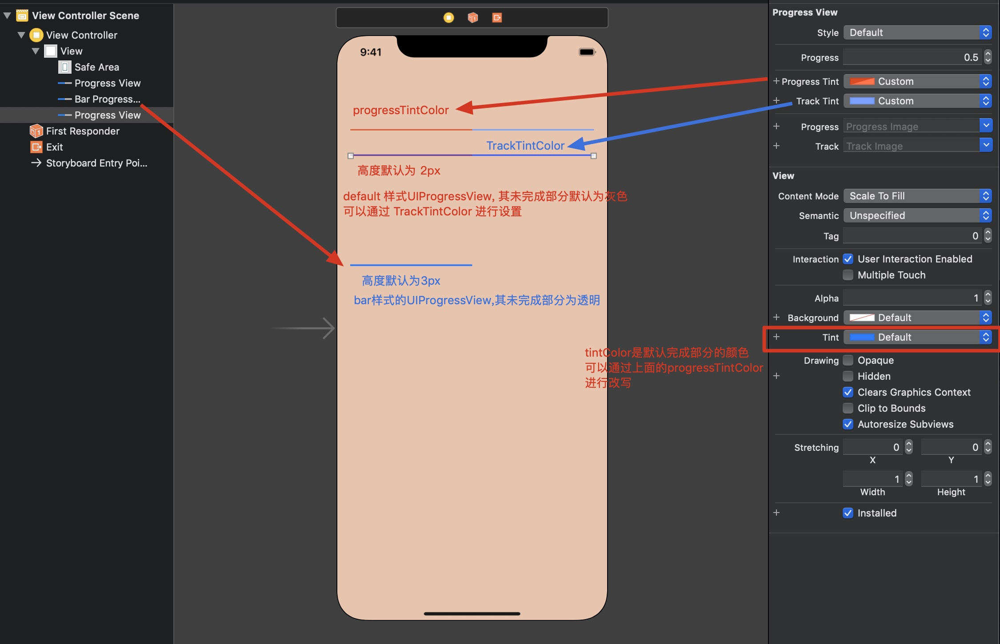
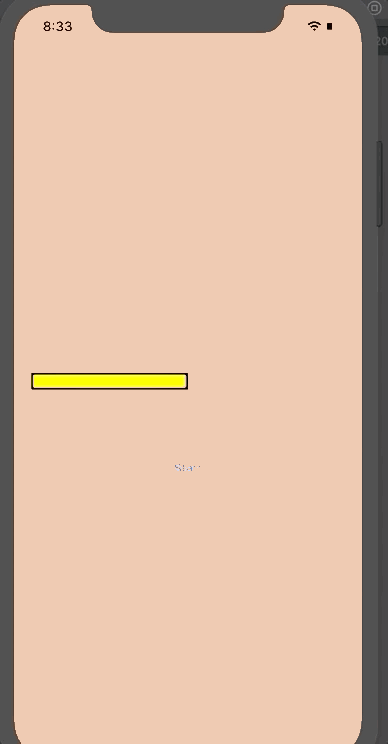
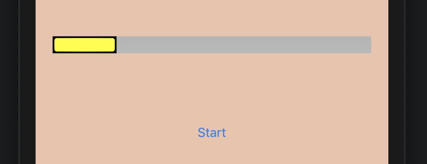
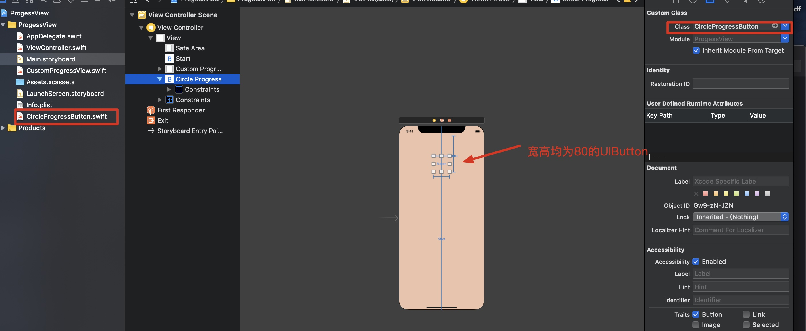
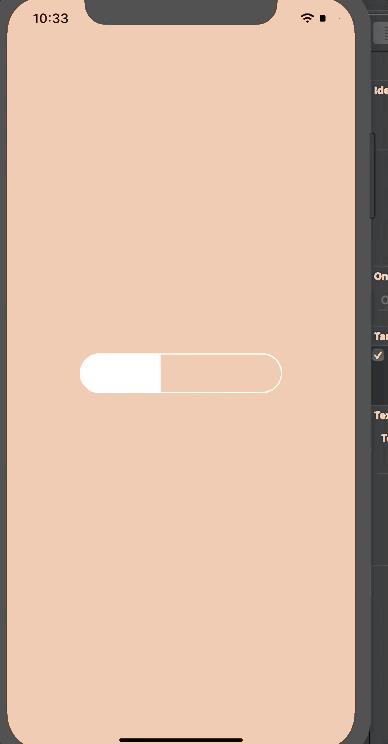
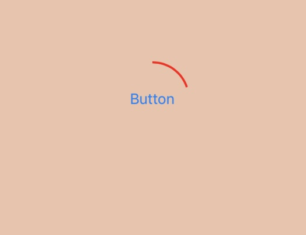

**`UIProgressView`** 多用于显示某项任务的进度，比如下载的进度，也是一个比较简单的控件。

```swift
import Foundation
import UIKit
import _SwiftUIKitOverlayShims

extension UIProgressView {

    
    public enum Style : Int {

        // 默认样式 进度条会有个背景
        // 高度 2px
        case `default`
      
				// 没有背景，多用于UIBarButtonItem 中
        // 比如打开某个页面，需要加载数据，可以添加这个进度条显示加载的进度
        // 高度 3px
        case bar
    }
}

@available(iOS 2.0, *)
open class UIProgressView : UIView, NSCoding {

    
    public init(frame: CGRect)

    public init?(coder aDecoder: NSCoder)

    public convenience init(progressViewStyle style: UIProgressView.Style) // sets the view height according to the style

    
    open var progressViewStyle: UIProgressView.Style // default is UIProgressViewStyleDefault

  	// 0.0 - 1.0 之间的Float值
    open var progress: Float // 0.0 .. 1.0, default is 0.0. values outside are pinned.

    @available(iOS 5.0, *)
  	// 进度条的颜色
    open var progressTintColor: UIColor?

    @available(iOS 5.0, *)
  	// 未完成部分的颜色
    open var trackTintColor: UIColor?

    @available(iOS 5.0, *)
  	// 可以使用图标表示已完成部分进度
    open var progressImage: UIImage?

    @available(iOS 5.0, *)
    // 未完成部分也可以使用图片
    open var trackImage: UIImage?

    
    @available(iOS 5.0, *)
  	// 设置进度条的值， 可以使用动画
    open func setProgress(_ progress: Float, animated: Bool)

    
    @available(iOS 9.0, *)
  	// 配合Progess, 用于观察进度值
    open var observedProgress: Progress?
}

```


## 属性

上面的接口基本上将属性进行了初略的介绍，下面图示对其进行简单的描述




## Progress View 的高度设置

上面的介绍中，已经讲明了2中不同样式的progress view 都存在一个默认的高度

- default: 2px
- bar: 3px

**直接设置其高度是不会生效的**，比如：

```swift
let pv = UIProgressView(progressViewStyle: .default)
// 通过设置其frame的height 无效
pv.frame = CGRect(x: 0, y: 0, width: 200, height: 20)
```

有2中方式对高度进行设置：

1. 使用自动布局约束，对高度进行约束

   ```swift
   let pv = UIProgressView(progressViewStyle: .default)
   pv.progressTintColor = .red // 完成部分 进度条颜色为红色
   pv.trackTintColor = .gray  // 未完成部分 颜色为灰色
   pv.progress = 0.5 // 设置其初始进度为 50% 位置， 默认是 0.0
   pv.translatesAutoresizingMaskIntoConstraints = false
   // 或者使用Interface Builder进行约束布局
   NSLayoutConstraint.activate([
   		// 对高度进行约束
       pv.heightAnchor.constraint(equalToConstant: 20)
       // ...
   ])
   ```

2. 使用 **`tranform`** 对 **`y`** 进行转换

   ```swift
   let pv = UIProgressView(progressViewStyle: .default)
   pv.transform = CGAffineTransform
   
   // 对高度扩大4倍
   // 即 default类型的高度为 2 * 4
   // bar类型的高度为 3 * 4
   pv.transform = pv.transform.scaledBy(x: 1, y: 4)
   // 或者使用
   pv.transform = CGAffineTransform(scaleX: 1.0, y: 4)
   ```


## 自定义进度条样式


### 1. 使用自定义绘制图片作为进度条


先在IB中使用autolayout将progress view的高度设置为 **`20`**， 然后添加一个按钮，使用 **`Timer`**， 每隔 **`1s`** 将进度加 **`0.1`**。

使用 **`progressImage`** 设置自定义 进度图片， 这个样式为带有黑色描边的黄色进度条

```swift

import UIKit

class ViewController: UIViewController {

    // 对应IB中的UIProgressView
    @IBOutlet weak var progressView: UIProgressView!
    override func viewDidLoad() {
        super.viewDidLoad()
        // Do any additional setup after loading the view.
        
    
    }
    
    override func viewDidLayoutSubviews() {
        super.viewDidLayoutSubviews()
        
        let r = UIGraphicsImageRenderer(size: CGSize(width: 10, height: 10))
        let im = r.image { (ctx) in
            let con = ctx.cgContext
            // 设置填充颜色为黄色
            con.setFillColor(UIColor.yellow.cgColor)
            con.fill(CGRect(x: 0, y: 0, width: 10, height: 10))
            let b = con.boundingBoxOfClipPath.insetBy(dx: 1, dy: 1)
            con.setLineWidth(2)
            con.setStrokeColor(UIColor.black.cgColor) // 设置描边颜色为 黑色
            con.stroke(b)
            con.strokeEllipse(in: b)
            
        }.resizableImage(withCapInsets: UIEdgeInsets(top: 4, left: 4, bottom: 4, right: 4), resizingMode: .stretch)
        
        // 将其设置为上面绘制的颜色
        self.progressView.progressImage = im
    }

    // IB中的UIButton的action
    @IBAction func startDownload(_ sender: Any) {
        self.progressView.progress = 0.0
        
        // 每个1s调用一次 inc函数 
        Timer.scheduledTimer(timeInterval: 1.0, target: self, selector: #selector(inc), userInfo: nil, repeats: true)
    }


    @objc func inc(_ t: Timer) {
        // 使用 self.progressView.progress 获取当前的进度值
        var val = Float(self.progressView.progress)
        val += 0.1
        self.progressView.setProgress(val, animated: true)
        
        if val >= 1.0 {
            t.invalidate()
        }
    }
}
```

最终效果：



进度条图片：

 


### 2. 使用UIView对UIProgressView进行模拟

为了更加灵活的自定义进度样式，可以使用 **`UIView`** 进行模拟操作，然后调用 **`draw`** 方法进行绘制，它有一个 **`value`** 属性，取值范围为 **`0.0 - 1.0`**， 然后调用 **`setNeedsDisplay`** 使得 **`draw`** 方法被重绘。


使用 **`UIGraphicsGetCurrentContext`** 绘制一个圆条形状，如下：



注意上面的 **`UIView`** 为了图片展示，将其背景色设置为了橙色，实际运行的时候会将这个背景色去掉。

```swift
// CustomProgressView.swift
import UIKit

class CustomProgressView: UIView {
    // 模拟progress属性 取值范围0.0-1.0
    var value: CGFloat = 0.0
    
    override func draw(_ rect: CGRect) {
        let c = UIGraphicsGetCurrentContext()!
        UIColor.white.set() // 设置进度条的背景色
        let ins: CGFloat = 2
        // 设置绘制区域 在原UIView尺寸的基础上向内缩 2 points
        let r = self.bounds.insetBy(dx: ins, dy: ins)
        // 2头圆弧的半径
        let radius: CGFloat = r.size.height / 2
        let d90 = CGFloat.pi / 2
      
        // 绘制路径
        let path = CGMutablePath()
        path.move(to: CGPoint(x: r.maxX - radius, y: ins))
        path.addArc(center: CGPoint(x: radius+ins, y: radius+ins), radius: radius, startAngle: -d90, endAngle: d90, clockwise: true)
        path.addArc(center: CGPoint(x: r.maxX - radius, y: radius + ins), radius: radius, startAngle: d90, endAngle: -d90, clockwise: true)
        path.closeSubpath()
        c.addPath(path)
        c.setLineWidth(2)
        c.strokePath()
        c.addPath(path)
        c.clip()
        c.fill(CGRect(x: r.origin.x, y: r.origin.y, width: r.width * self.value, height: r.height))
    }
}
```

`ViewController.swift`

```swift
import UIKit

class ViewController: UIViewController {

   
    @IBOutlet weak var customProgressView: CustomProgressView!
    override func viewDidLoad() {
        super.viewDidLoad()
    }
    
    @IBAction func startDownload(_ sender: Any) {
        self.customProgressView.value = 0.0
        // setNeedsDisplay使 draw 方法被调用
        self.customProgressView.setNeedsDisplay()
        Timer.scheduledTimer(timeInterval: 1.0, target: self, selector: #selector(inc), userInfo: nil, repeats: true)
    }


    @objc func inc(_ t: Timer) {
        var val = Float(self.customProgressView.value)
        val += 0.1
        
        // 更新value值
        self.customProgressView.value = CGFloat(val)
        self.customProgressView.setNeedsDisplay()
        
        if val >= 1.0 {
            t.invalidate()
        }
    }
}

```

其效果：




### 3.使用UIButton 绘制圆形进度条


使用 **`CAShapeLayer`** 的 **`strokeEnd`** 属性来绘制一个圆弧型进度条，让这个类继承 **`UIButton`**


**`CircleProgressButton`**:

```swift
import UIKit

class CircleProgressButton: UIButton {
    var progress: Float = 0 {
        didSet {
            if let layer = self.shapelayer {
                layer.strokeEnd = CGFloat(self.progress)
            }
        }
    }
    
    private var shapelayer: CAShapeLayer!
    private var didLayout = false
    
    override func layoutSubviews() {
        super.layoutSubviews()
        
        guard !self.didLayout else {
            return
        }
        
        self.didLayout = true
        
        let layer = CAShapeLayer()
        layer.frame = self.bounds
        layer.lineWidth = 2 // 圆弧的宽度
        layer.fillColor = nil // 填充颜色为空
        layer.strokeColor = UIColor.red.cgColor // 描边颜色
        let b = UIBezierPath(ovalIn: self.bounds.insetBy(dx: 3, dy: 3)) // 贝塞尔路径
        b.apply(CGAffineTransform(translationX: -self.bounds.width / 2, y: -self.bounds.height / 2))
        b.apply(CGAffineTransform(rotationAngle: -.pi/2.0))
        b.apply(CGAffineTransform(translationX: self.bounds.width / 2, y: self.bounds.height / 2))
        
        layer.path = b.cgPath
        self.layer.addSublayer(layer)
        layer.zPosition = -1
        layer.strokeStart = 0
        layer.strokeEnd = 0 // 使用这个模拟进度
        self.shapelayer = layer
    }
}
```

**`ViewController.swift`**:

```swift
import UIKit

class ViewController: UIViewController {

		// UIButton 按钮
    @IBOutlet weak var circleProgress: CircleProgressButton!
    
    override func viewDidLoad() {
        super.viewDidLoad()
    }
    
    @IBAction func startDownload(_ sender: Any) {
        
        self.circleProgress.progress = 0.0
        Timer.scheduledTimer(timeInterval: 1.0, target: self, selector: #selector(inc), userInfo: nil, repeats: true)
    }


    @objc func inc(_ t: Timer) {
        var val = Float(self.circleProgress.progress)
        val += 0.1
         
        self.circleProgress.progress = val
        
        if val >= 1.0 {
            t.invalidate()
        }
    }
}


```

效果图如下：




## 配合 Progress 对象

**`Progress`** 类提供了很多和任务进度相关的属性：

- **`totalUnitCount`**: 总的任务量
- **`completedUnitCount`**: 完成的任务量
- **`fractionCompleted`**: 这个是 **`completedUnitCount/totalUnitCount`**, 即可以表示进度的概念

另外UIProgressView 有一个 **`observedProgress`** 属性，可以将一个 **`Progress `** 对象赋值给它，**progress view 会自动的进行更新（一种 KVO）**。

```swift
import UIKit

class MySpyProgressView: UIProgressView {
    override func setProgress(_ progress: Float, animated: Bool) {
        super.setProgress(progress, animated: animated)
        print(progress)
    }
    
    override var progress: Float {
        get {
            return super.progress
        }
        
        set {
            super.progress = newValue
            print(progress)
        }
    }
}

class ProgressingOperation {
    let progress: Progress
    init(units: Int) {
      	// totalUnitCount 任务总量
        self.progress = Progress(totalUnitCount: Int64(units))
    }
    
    func start() {
        Timer.scheduledTimer(timeInterval: 1, target: self, selector: #selector(inc), userInfo: nil, repeats: true)
    }
    
    @objc func inc(_ t: Timer) {
      	// 这里假设完成量+1
        self.progress.completedUnitCount += 1
      
        // fractionCompleted 即进度
        if self.progress.fractionCompleted >= 1.0 {
            t.invalidate()
            print("完成")
        }
    }
}


class ViewController: UIViewController {
    
  	// 按钮
    lazy var startButton: UIButton = {
        let button = UIButton()
        button.setTitle("start", for: .normal)
        button.setTitleColor(.red, for: .normal)
        button.translatesAutoresizingMaskIntoConstraints = false
        button.addTarget(self, action: #selector(startDownload), for: .touchUpInside)
        return button
    }()

  	// progress view
    lazy var progressView: MySpyProgressView = {
        let pv = MySpyProgressView()
        pv.translatesAutoresizingMaskIntoConstraints = false
        return pv
    }()
    
    var op: ProgressingOperation?
    
    override func viewDidLoad() {
        super.viewDidLoad()
        
        self.view.addSubview(startButton)
        self.view.addSubview(progressView)
    
        NSLayoutConstraint.activate([
            progressView.centerXAnchor.constraint(equalTo: view.centerXAnchor),
            progressView.centerYAnchor.constraint(equalTo: view.centerYAnchor),
            progressView.leadingAnchor.constraint(equalTo: view.leadingAnchor, constant: 20),
            progressView.trailingAnchor.constraint(equalTo: view.trailingAnchor, constant: -20)
            ])
        
        NSLayoutConstraint.activate([
            startButton.centerXAnchor.constraint(equalTo: view.centerXAnchor),
            startButton.topAnchor.constraint(equalTo: progressView.bottomAnchor, constant: 20)
            ])
        
        
    }
    
    @objc func startDownload(_ sender: Any) {
        self.progressView.progress = 0.0
        self.op = ProgressingOperation(units: 10)
      	// 使用 observedProgress 属性 这个属性会自动的更新progress view
        self.progressView.observedProgress = self.op!.progress
        self.op?.start()
    }
    
}
```

上面是 **`Progress`** 的一种用法，这个类功能比较齐全，还有很多功能有待以后进一步的学习。


2019年06月12日11:37:45

